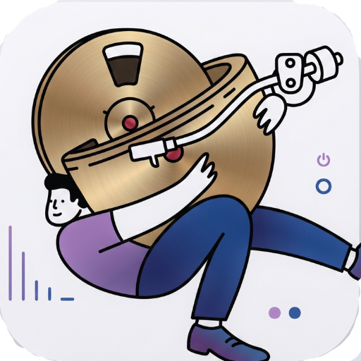

<p align="center">
  
</p>

<h1 align="center">Audiophilia</h1>

<p align="center">
  <b>High-definition audio, bit-perfect.</b><br />
  A native macOS music player for lossless libraries — with automatic sample-rate switching,
  a 10-band parametric EQ, and a Liquid Glass interface.
</p>

<p align="center">
  
  
  
  
</p>

---

## ✨ Features

|  |  |
|---|---|
| 🔥 **Bit-perfect playback** | AVAudioEngine renders directly to your output device via the CoreAudio HAL — no resampling, no SRC, no processing artifacts. |
| 📶 **Automatic sample-rate switching** | The DAC is told to switch to the exact sample rate of every source track (44.1/48/88.2/96/176.4/192 kHz …), preventing clicks and pops between songs. |
| 🎼 **Lossless-first library** | Native support for **FLAC, ALAC (M4A), WAV and AIFF**, plus MP3/AAC. FLAC & ALAC tracks earn a dedicated **LOSSLESS** badge with full sample-rate/bit-depth specs. |
| 🎚️ **10-band parametric EQ** | ISO-standard bands (31 Hz – 16 kHz) with named sound-style presets — Flat, Rock, Jazz, Bass Boost and more — toggled on/off instantly. |
| 🗂️ **Full library management** | Import folders (with Security-Scoped access), browse by **Albums, Artists, Tracks, Folders, and Playlists**, plus instant search. |
| 🖼️ **Embedded artwork** | Metadata and cover art are extracted from your files **locally — zero network access** — and cached for instant playback UI. |
| 🖥️ **Three player modes** | Floating playbar, full-screen **Now Playing** view, and a picture-in-picture **mini player** that floats above every window. |
| 💎 **Liquid Glass UI** | Apple's translucent **Liquid Glass** material, three frosted-glass intensities (Ultra Thin / Thin / Regular) and switchable accent themes. |
| 🎛️ **Native macOS feel** | Original SwiftUI views, keyboard-friendly playback controls, shuffle/repeat, seamless seeking. |

---

## 🖼️ Screenshots

> Coming soon — screenshots will be added as the UI stabilizes.

---

## ⚙️ Requirements

- **macOS 14.0 (Sonoma)** or later
- Apple Silicon **or** Intel Mac
- ~50 MB of free disk space

---

## 📥 Installation

### Option A — Download the DMG

1. Head to the [**Releases**](https://github.com/NavatejR/audiophilia/releases) page.
2. Download the latest `Audiophilia-x.y.z.dmg`.
3. Open the downloaded disk image.
4. **Drag `Audiophilia.app`** into your `Applications` folder.
5. First launch: because the app is **not signed with an Apple Developer ID** yet, right-click `Audiophilia.app` → **Open** → **Open** (or go to *System Settings → Privacy & Security* and click **Open Anyway**).
6. Done — enjoy bit-perfect audio. 🎧

### Option B — Build from source (Xcode)

```bash
git clone https://github.com/NavatejR/audiophile.git
cd audiophile
open Audiophilia.xcodeproj
```

- In Xcode, pick the **Audiophilia** scheme and target **My Mac**.
- Press **⌘R** to build & run.

### Option C — Build from the terminal

```bash
git clone https://github.com/NavatejR/audiophile.git
cd audiophile
xcodebuild -project Audiophilia.xcodeproj \
           -target Audiophilia \
           -configuration Release \
           build
```

The built app lands at `build/Build/Products/Release/Audiophilia.app`.

### Creating your own DMG

```bash
hdiutil create -volname Audiophilia \
               -srcfolder build/Build/Products/Release/Audiophilia.app \
               -ov -format UDZO \
               Audiophilia.dmg
```

---

## 🚀 Getting Started

1. **Add your music folder** — choose *Folders* in the sidebar and click **+** to import a folder of FLAC, ALAC, WAV, AIFF (or MP3/AAC) files.
2. **Pick your output device** — open *Devices* in the sidebar and select your DAC or interface.
3. **Toggle Bit-Perfect** — switch off and the engine matches your track's sample rate 1:1.
4. **Tune the EQ** — enable the equalizer and apply a sound-style preset, or set your 10 band gains by hand.
5. **Play** — launch from any Album, Track, or Playlist and float the mini player… so the music follows you everywhere.

---

## 🛠️ Tech Stack

- **SwiftUI + AppKit** for the UI and window management
- **AVAudioEngine / AVAudioPlayerNode** for playback
- **AVFoundation** for lossy/lossless decoding
- **CoreAudio + AudioToolbox (HAL)** for bit-perfect output, device discovery, and sample-rate switching
- **Combine** for reactive state (library, player, theme)
- **Document-based persistence** — the library, folders, and playlists live as JSON in `~/Library/Application Support/Audiophilia`

---

## 📁 Project Structure

```
Audiophilia/
├── Audiophilia.xcodeproj         # Xcode project
└── Audiophilia/
    ├── AudiophiliaApp.swift      # App entry, NSWindow/titlebar configuration
    ├── ContentView.swift         # Root layout – sidebar splitter, playbar, fullscreen player
    ├── Audio/
    │   ├── AudioEngine.swift     # Playback engine, bit-perfect output, sample-rate switching, EQ
    │   ├── FormatParsers.swift   # Lightweight FLAC metadata/artwork parser
    │   └── MetadataExtractor.swift # Metadata + artwork extraction (offline)
    ├── Library/
    │   └── LibraryManager.swift # Folder scanning, persistence, playlists, artwork cache
    ├── Models/
    │   ├── PlayerState.swift    # Shared player & UI state
    │   ├── Playlist.swift       # Playlist model
    │   ├── ThemeManager.swift   # Liquid Glass presets, EQ sound styles
    │   └── Track.swift          # Track model & audio specs
    ├── Views/
    │   └── SettingsView.swift   # Appearance / Library / Playback settings
    ├── WindowManagement/
    │   └── MiniPlayerPanelController.swift # Picture-in-picture mini player
    └── Assets.xcassets          # App icon, accent colours,…
```

---

## 📜 License

Released under the **MIT License**. See [LICENSE](LICENSE) for details.